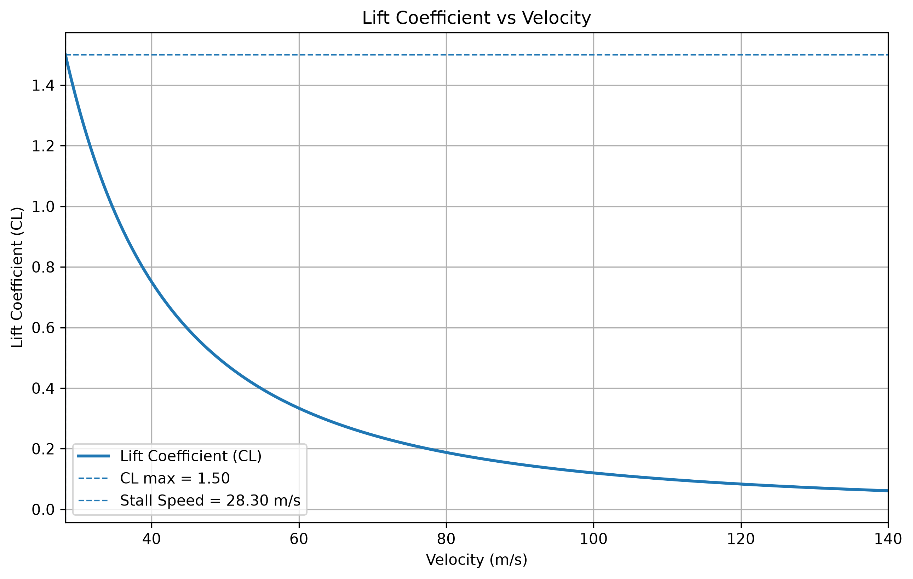
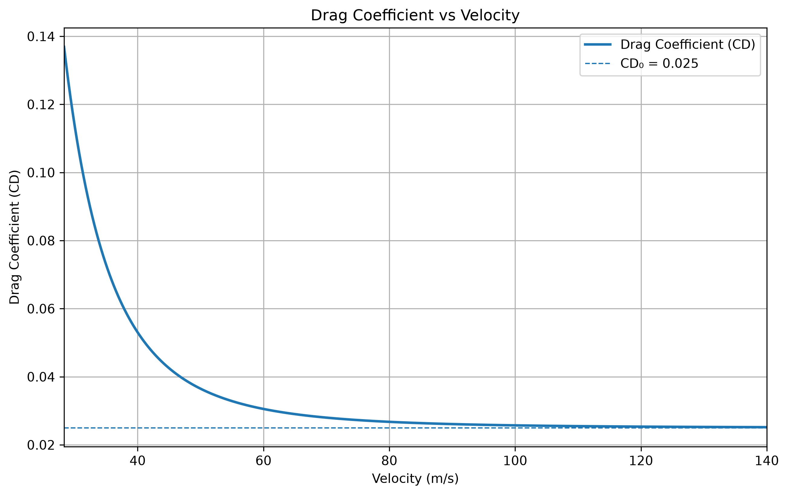
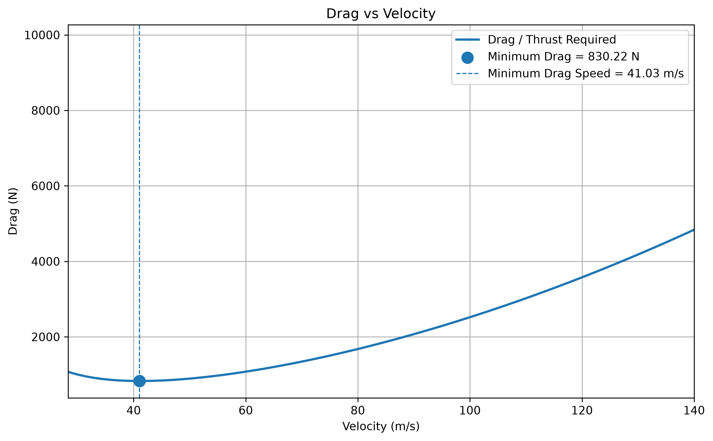
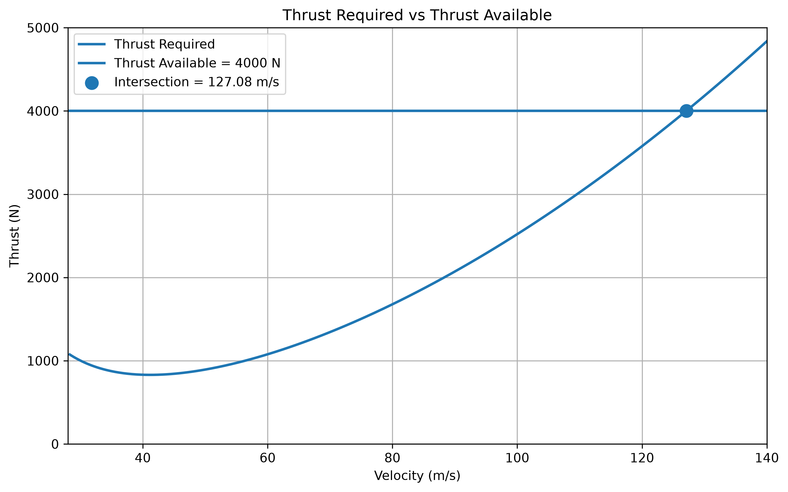
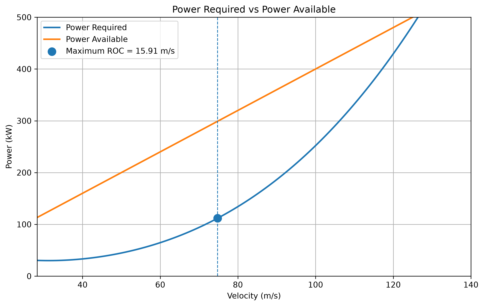
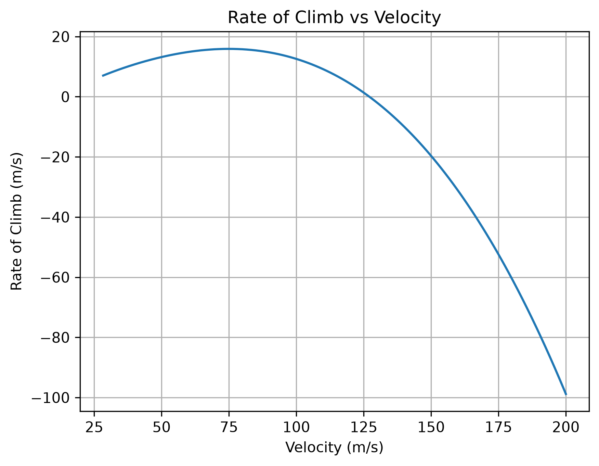

# Aircraft Performance Analysis

A Python-based aircraft performance analysis tool that evaluates the aerodynamic and flight-performance characteristics of an aircraft using fundamental aircraft performance equations.

## Overview

This project analyzes the performance of a 1200 kg aircraft using aerodynamic parameters such as wing area, aspect ratio, Oswald efficiency, zero-lift drag coefficient, and maximum lift coefficient.

The program calculates lift, drag, thrust required, thrust available, power required, power available, stall speed, maximum L/D, maximum level-flight speed, excess power, and rate of climb.

## Objectives

- Calculate lift and drag characteristics over a range of velocities.
- Determine stall speed.
- Determine the velocity for maximum lift-to-drag ratio.
- Calculate thrust required and thrust available.
- Determine maximum level-flight speed.
- Calculate power required and power available.
- Determine maximum rate of climb.
- Visualize aircraft performance using Python-generated graphs.

## Aircraft Parameters

| Parameter | Value |
|---|---:|
| Aircraft Mass | 1200 kg |
| Wing Area | 16 m² |
| Aspect Ratio | 8 |
| Oswald Efficiency | 0.8 |
| Zero-Lift Drag Coefficient | 0.025 |
| Maximum Lift Coefficient | 1.5 |
| Thrust Available | 4000 N |

## Methodology

The analysis uses steady, level-flight assumptions and standard aerodynamic relationships.

### Aircraft Weight

W = mg

### Lift Coefficient

CL = W / (0.5 × ρ × V² × S)

### Induced Drag Factor

K = 1 / (π × e × AR)

### Drag Coefficient

CD = CD0 + KCL²

### Drag / Thrust Required

D = 0.5 × ρ × V² × S × CD

For steady level flight:

T_required = D

### Stall Speed

Vs = √(2W / (ρSCLmax))

### Lift-to-Drag Ratio

L/D = CL / CD

### Power Required

P_required = T_required × V

### Power Available

P_available = T_available × V

### Rate of Climb

ROC = (P_available − P_required) / W

## Key Results

| Performance Parameter | Result |
|---|---:|
| Stall Speed | 28.30 m/s |
| Stall Speed | 101.88 km/h |
| Maximum L/D | 14.18 |
| Speed at Maximum L/D | 41.16 m/s |
| Minimum Thrust Required | 830.22 N |
| Thrust Available | 4000 N |
| Maximum Excess Thrust | 3169.78 N |
| Maximum Level-Flight Speed | 127.08 m/s |
| Maximum Level-Flight Speed | 457.48 km/h |
| Maximum Excess Power | 187.26 kW |
| Speed for Maximum ROC | 74.75 m/s |
| Maximum Rate of Climb | 15.91 m/s |

## Key Findings

The analysis predicts a stall speed of 28.30 m/s and a maximum lift-to-drag ratio of 14.18 at approximately 41.16 m/s.

With a modeled thrust availability of 4000 N, the aircraft reaches a maximum level-flight speed of approximately 127.08 m/s (457.48 km/h).

The maximum predicted rate of climb is 15.91 m/s at approximately 74.75 m/s.

## Performance Graphs

The program generates the following performance plots:

- Lift Coefficient vs Velocity
- Drag Coefficient vs Velocity
- Drag / Thrust Required vs Velocity
- Thrust Required vs Thrust Available
- Power Required vs Power Available
- Rate of Climb vs Velocity

## Assumptions

- Standard sea-level atmospheric density is used.
- Steady, level-flight conditions are assumed.
- Aircraft weight remains constant during the analysis.
- Thrust available is modeled as constant at 4000 N.
- The drag polar is represented by CD = CD0 + KCL².
- Compressibility and high-speed aerodynamic effects are not included.
- Propulsive and engine performance variations with altitude and velocity are not modeled.

## Limitations

This is a conceptual aircraft-performance model and is not intended to represent a complete flight-dynamics or certified aircraft-performance model.

Real aircraft performance is affected by altitude, atmospheric conditions, engine characteristics, propeller/jet efficiency, compressibility, Reynolds number, configuration changes, and other aerodynamic effects.

## Future Improvements

Possible extensions include:

- Altitude-dependent performance analysis
- Variable thrust available
- Fuel-burn and aircraft-weight variation
- Take-off and landing performance
- Range and endurance calculations
- Compressibility corrections
- Mach-number analysis
- Payload and weight sensitivity analysis
- Interactive performance plots

## Technologies Used

- Python
- NumPy
- Matplotlib

## Author

Aerospace Engineering Student

---

*This project was developed as an academic aircraft-performance analysis using fundamental aerodynamic and performance equations.*

## Performance Graphs

### Lift Coefficient vs Velocity

### Drag Coefficient vs Velocity

### Drag vs Velocity

### Thrust Required vs Thrust Available

### Power Required vs Power Available

### Rate of Climb vs Velocity

